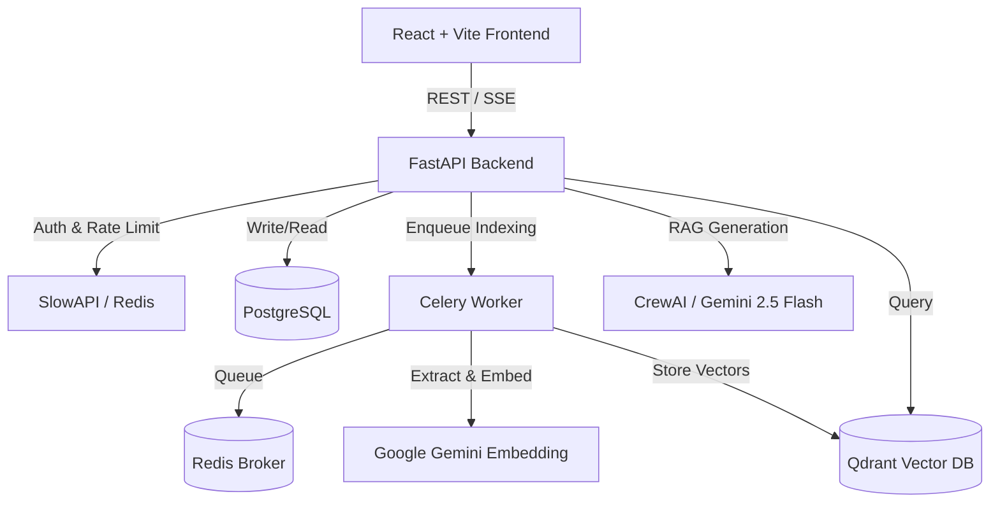

<div align="center">
  

  <h1>OpsLens</h1>
  
  <p><b>An Autonomous AI-Powered Incident Investigation Platform</b></p>

  <p>
    <a href="https://github.com/Sanket2329/OpsLens/actions/workflows/ci.yml">
      
    </a>
    
    
    
    
    
  </p>
</div>

---

OpsLens helps DevOps, SRE, and Platform Engineering teams investigate production incidents autonomously. Instead of manually digging through fragmented runbooks and architecture diagrams, you describe the incident, and OpsLens utilizes **Google Gemini** and **CrewAI** agents to cross-reference your knowledge base via **Retrieval-Augmented Generation (RAG)**. 

The result? An evidence-backed Root Cause Analysis (RCA) report containing actionable remediation steps in seconds.

## ✨ Enterprise-Grade Features

* 🧠 **Multi-Agent RAG Architecture:** Orchestrates dynamic AI workflows utilizing CrewAI and Qdrant vector search to diagnose outages.
* ⚡ **Asynchronous Background Processing:** Employs **Celery + Redis** to offload heavy PDF vector embeddings, keeping the API lightning-fast and responsive.
* 🎨 **Premium User Experience:** Features a lightning-fast `Cmd+K` global command palette, native side-by-side document previews, and graceful React Error Boundaries.
* 🔒 **High-Security API:** Protected by JWT Authentication, granular Role-Based Access Control (RBAC), and strict IP rate limiting via `slowapi` to prevent LLM abuse.
* 🚀 **Production DevOps Pipeline:** Fully containerized with Docker Compose and heavily guarded by a GitHub Actions CI/CD pipeline running Pytest and **Playwright End-to-End UI tests**.

---

## 🏗️ Technical Architecture



## 🛠️ Tech Stack

| Category | Technology |
| --- | --- |
| **Frontend** | React 18, Vite, Tailwind CSS, shadcn/ui |
| **Backend** | Python 3.11, FastAPI, SQLAlchemy, Pydantic |
| **AI & Search** | Google Gemini (LLM & Embeddings), CrewAI, Qdrant |
| **Workers & Cache** | Celery, Redis |
| **Database** | PostgreSQL |
| **DevOps** | Docker, Docker Compose, GitHub Actions |
| **Testing** | Pytest, Playwright |

---

## 🚀 Quick Start (Local Development)

### Prerequisites
- Docker & Docker Compose
- Node.js 20+
- Google AI Studio API Key (`GEMINI_API_KEY`)

### 1. Configure the Environment
```bash
git clone https://github.com/Sanket2329/OpsLens.git
cd OpsLens
cp backend/.env.example backend/.env
```
Update `backend/.env` with your Gemini API key and generate a secure JWT secret:
```env
GEMINI_API_KEY=your-gemini-key
JWT_SECRET=generate_a_secure_random_string
```

### 2. Launch the Microservices
OpsLens relies on a distributed architecture. Start PostgreSQL, Qdrant, Redis, and the Celery workers instantly via Docker Compose:
```bash
docker compose up -d --build
```

### 3. Start the Frontend Application
```bash
cd frontend
npm install
npm run dev
```
Navigate to `http://localhost:8080` (or the port specified by Vite) to access the OpsLens Dashboard.

---

## 🧪 Testing & CI/CD

OpsLens maintains strict quality controls via its GitHub Actions pipeline.

**Backend (Pytest)**
```bash
cd backend
source .venv/bin/activate
python -m pytest tests/ -v
```

**Frontend (Playwright E2E)**
```bash
cd frontend
npx playwright test
```

---

## 🔒 Security & RBAC

OpsLens enforces organization-scoped data isolation. Additionally, sensitive operations (such as permanently deleting knowledge base documents from Qdrant and Postgres) are strictly restricted to users with the `admin` role via custom FastAPI dependencies.

## 🤝 Contributing
Contributions, issues, and feature requests are welcome! Feel free to check [issues page](https://github.com/Sanket2329/OpsLens/issues).

## 📜 License
Distributed under the MIT License. See `LICENSE` for more information.
