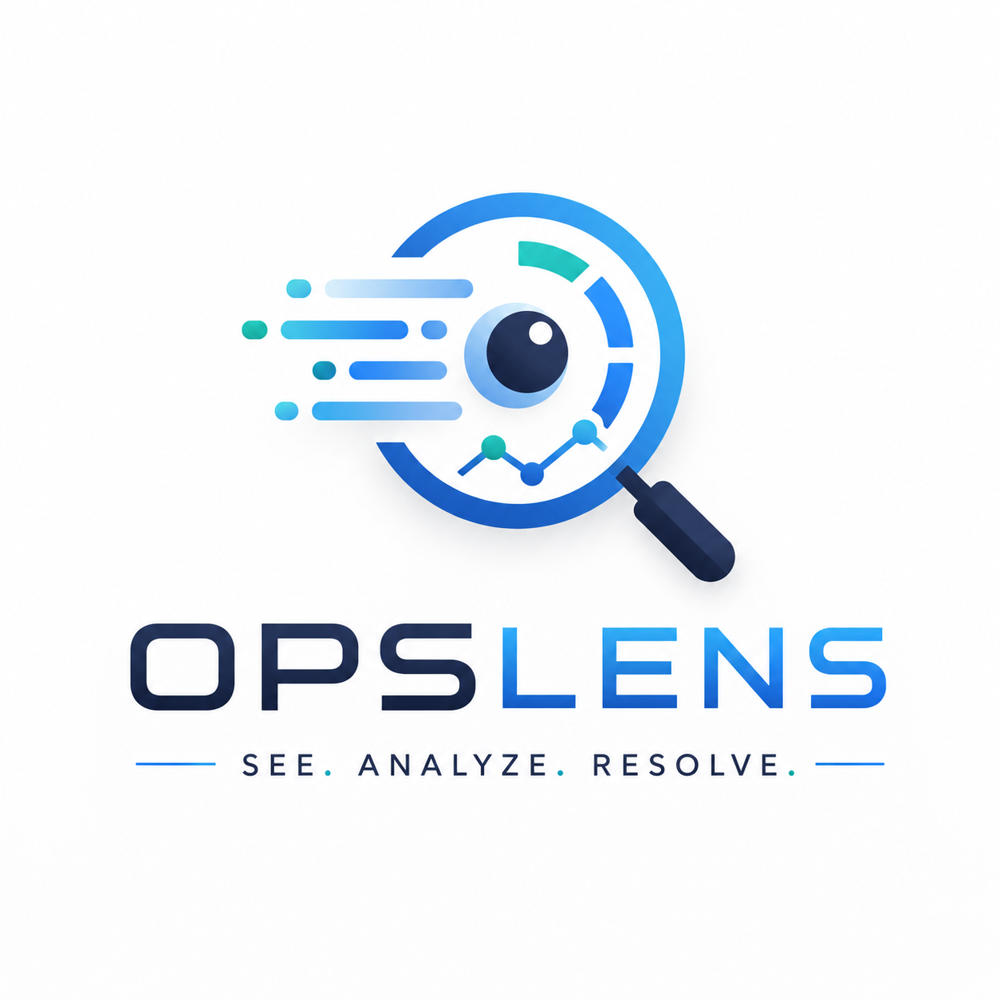
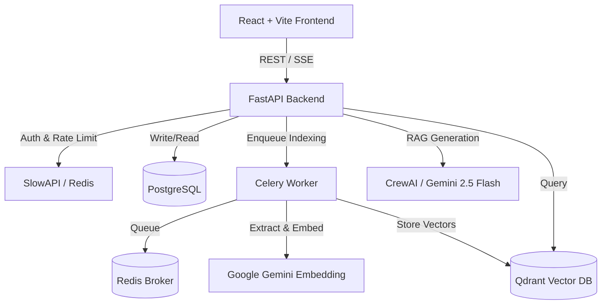

<div align="center">
  

  <h1 style="margin-top: 20px;">OpsLens</h1>
  
  <p><b>Your Autonomous AI SRE & Incident Investigation Platform</b></p>

  <p>
    <a href="https://github.com/Sanket2329/OpsLens/actions/workflows/ci.yml">
      
    </a>
    
    
    
    
    
  </p>
  
  <p>
    <i>Turn fragmented runbooks, scattered logs, and architecture diagrams into instant, actionable Root Cause Analyses (RCA).</i>
  </p>
</div>

<br />

---

## 🚀 Overview

**OpsLens** is an enterprise-grade, multi-agent AI platform built for DevOps, Site Reliability Engineers (SREs), and Platform Engineering teams. When production goes down, every second counts. OpsLens autonomously investigates incidents by utilizing **Google Gemini** and orchestrating **CrewAI** agents to cross-reference your organization's entire knowledge base via **Retrieval-Augmented Generation (RAG)**.

Instead of manually digging through outdated PDFs or searching confluence, you simply describe the incident. OpsLens provides an evidence-backed Root Cause Analysis alongside immediate, actionable remediation steps.

<br />

## 🌟 Detailed Feature Breakdown

OpsLens is packed with powerful features designed to streamline the lifecycle of incident response.

### 🕵️ Autonomous Incident Investigation (3-Agent Crew)
Simply type in a description of an ongoing outage (e.g., *"The payment gateway API is returning 504 Timeouts"*). OpsLens delegates this to a specialized **CrewAI** team of exactly **3 distinct agents**:
1. **The Analyst (Senior SRE):** Diagnoses the root cause by cross-referencing your documentation and assigns an evidence-based confidence score.
2. **The Recommender (Platform Engineer):** Takes the diagnosis and formulates specific, immediately actionable remediation steps (e.g., exact SQL queries or kubectl commands).
3. **The Reporter (Technical Writer):** Synthesizes all the findings from the previous agents into a highly structured, machine-readable JSON Root Cause Analysis (RCA) report.

### 📚 Knowledge Base Management (RAG)
Upload your organization's PDF runbooks, disaster recovery plans, and architecture diagrams directly into OpsLens. The platform uses an advanced **Retrieval-Augmented Generation (RAG)** pipeline to contextually chunk and embed your documents into a **Qdrant Vector Database**. This guarantees that the AI always draws upon your company's actual, private infrastructure data instead of hallucinating answers.

### 📈 Live Grafana & Prometheus Integration
OpsLens AI agents don't just read static PDFs—they can look at your live servers! The Analyst agent is equipped with a custom Tool that securely queries your **Grafana Cloud / Prometheus** HTTP APIs using PromQL. If the AI suspects a memory leak based on a runbook, it will autonomously pull the live memory metrics to prove it before generating the RCA.

### ⚡ Asynchronous Background Processing
Heavy AI tasks—like chunking a 100-page runbook, generating thousands of vector embeddings via Google Gemini, or waiting for multi-agent workflows—are seamlessly offloaded to background **Celery workers** backed by **Redis**. This ensures the FastAPI backend and React frontend remain lightning-fast and perfectly responsive at all times.

### 📊 Interactive Incident Dashboard
Get a high-level view of your system's health. The OpsLens Dashboard provides rich data visualizations, historical incident logs, and real-time status updates on ongoing AI investigations. It serves as the central command center during a Sev-1 incident.

### ⌨️ Global Command Palette (`Cmd+K`)
Time is critical during an outage. OpsLens features a blazing-fast, system-wide command palette. Hit `Cmd+K` from anywhere in the application to instantly search for past incidents, navigate to your uploaded runbooks, or start a new investigation chat.

### 🔒 Enterprise-Grade Security & RBAC
- **Role-Based Access Control:** Secure your data by assigning granular `admin` and `viewer` roles. Sensitive operations (like deleting critical runbooks from the Qdrant DB) are strictly guarded.
- **DDoS & Abuse Protection:** The API is hardened using `slowapi` for strict IP rate limiting, protecting your LLM quota and infrastructure from abuse.
- **Containerized Isolation:** Fully encapsulated in Docker containers for secure, repeatable deployments.

<br />

## 🏗️ Technical Architecture

<details>
<summary><b>Click to view Architecture Diagram</b></summary>



</details>

<br />

## 💻 Tech Stack

| Domain | Technologies |
| :--- | :--- |
| **Frontend** | React 18, Vite, Tailwind CSS, shadcn/ui, TanStack Router |
| **Backend** | Python 3.11, FastAPI, SQLAlchemy, Pydantic |
| **AI & Search** | Google Gemini (LLM & Embeddings), CrewAI, Qdrant Vector DB |
| **Workers & Cache** | Celery, Redis |
| **Database** | PostgreSQL |
| **DevOps & Testing** | Docker Compose, GitHub Actions, Pytest, Playwright |

<br />

## ⚡ Getting Started (Local Development)

### Prerequisites
- **Docker & Docker Compose** installed and running.
- **Node.js 20+**
- A valid **Google AI Studio API Key** (`GEMINI_API_KEY`)

### 1. Configure the Environment
Clone the repository and set up your `.env` file:
```bash
git clone https://github.com/Sanket2329/OpsLens.git
cd OpsLens
cp backend/.env.example backend/.env
```
Open `backend/.env` and update your Gemini key and JWT secret:
```env
GEMINI_API_KEY=your-gemini-api-key
JWT_SECRET=super_secure_random_string_here
```

### 2. Launch the Microservices
Spin up PostgreSQL, Qdrant, Redis, the FastAPI backend, and Celery workers with a single command:
```bash
docker compose up -d --build
```

### 3. Start the Frontend
Fire up the React development server:
```bash
cd frontend
npm install
npm run dev
```
Navigate to `http://localhost:8080` and start investigating!

<br />

## 🧪 Testing

We take reliability seriously. Run the automated test suites to verify system integrity:

**Backend (Unit & Integration Tests)**
```bash
docker compose exec api pytest tests/ -v
```

**Frontend (Playwright E2E Tests)**
```bash
cd frontend
npx playwright test
```

<br />

## 🤝 Contributing
Contributions, issues, and feature requests are highly encouraged! Feel free to check the [Issues page](https://github.com/Sanket2329/OpsLens/issues) if you want to contribute.

## 📜 License
This project is open-sourced under the **MIT License**. See the [LICENSE](LICENSE) file for more information.

<br />

<div align="center">
  <sub>For Site Reliability Engineers everywhere.</sub>
</div>
